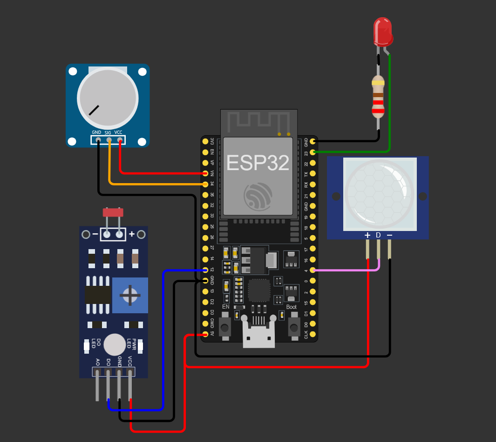
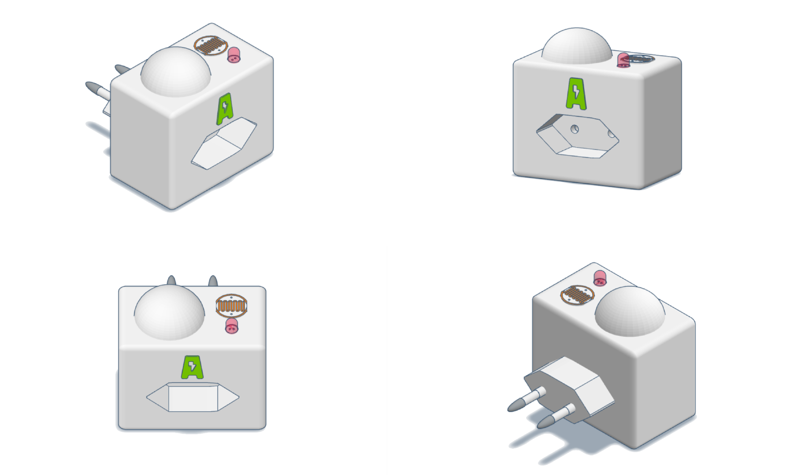
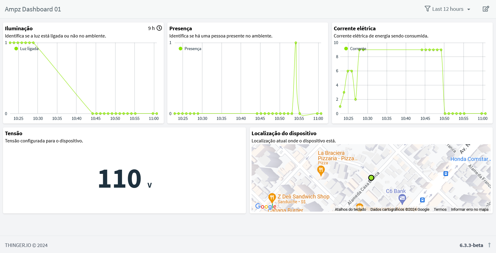

---

Este repositório contém o projeto **Ampz**, desenvolvido como parte da disciplina de Disruptive Architectures: IoT, IoB & Generative AI. O objetivo do projeto é promover o consumo consciente de energia elétrica utilizando sensores IoT, um ESP-32 e um sistema de gamificação interativo. A solução se destaca por combinar IoT com gamificação, promovendo o uso consciente de energia de forma didática e divertida.

---

## 🚀 Vídeo do Pitch do projeto  

[Link para o vídeo](https://www.youtube.com/watch?v=AjYOZ6lY51U) apresentando a solução, seus benefícios e funcionamento.  

---

## 📋 **Descrição do Projeto**  

O projeto visa identificar desperdício de energia elétrica em ambientes frequentados por crianças, utilizando:  
- **Sensor de luz (fotoresistor)**: Detecta se a luz está acesa.  
- **Sensor de corrente**: Verifica se há dispositivos consumindo energia.  
- **Sensor PIR**: Detecta a presença no ambiente.  
- **LED vermelho**: Indica quando há desperdício de energia elétrica.  

Os dados coletados pelos sensores são enviados para a plataforma **thinger.io** via **protocolo IOTMP**, onde são processados e exibidos em um **dashboard em tempo real**. Um aplicativo conectado ao sistema aplica conceitos de gamificação para motivar o uso consciente de energia.  

---

## 🚀 **Funcionalidades**  

- Monitoramento em tempo real do consumo de energia elétrica.  
- Detecção de desperdício de energia (luz acesa sem presença ou dispositivos conectados desnecessariamente).  
- Alerta visual por meio de LED vermelho.  
- Painel interativo no **thinger.io** para acompanhamento dos dados.  
- Aplicativo gamificado que incentiva a redução do desperdício de energia.  

---

## 🛠️ **Componentes Utilizados**  

### **Hardware:**  
- **ESP-32**: Microcontrolador principal.  
- **Sensor de luz (fotoresistor)**: Detecta se a luz está acesa.  
- **Sensor de corrente**: Mede o consumo energético de dispositivos conectados (Simulado utilizando o potenciometro).
- **Sensor PIR**: Identifica a presença de pessoas no ambiente.  
- **LED vermelho**: Sinaliza desperdício de energia.  

### **Software e Plataforma:**  
- **Thinger.io**: Gateway e plataforma para criação de dashboards.  
- **IOTMP**: Protocolo de comunicação entre os dispositivos IoT e o gateway.  
- **Wokwi**: Simulador para testes preliminares.

---

## 🌐 **Arquitetura do Sistema**  

### **Fluxo de dados:**  
1. **Sensores IoT** detectam condições do ambiente (luz, consumo de energia, presença).  
2. **ESP-32** processa os dados coletados e os envia ao **Thinger.io** via protocolo MQTT.  
3. **Thinger.io** organiza os dados em dashboards interativos, permitindo monitoramento em tempo real.  
4. O aplicativo conecta-se ao **Thinger.io** para aplicar gamificação baseada nos dados do dashboard.  

### Diagrama
Você pode acessar a simulação e diagrama interativo do dispositivo no Wokwi [clicando aqui](https://wokwi.com/projects/414675519131413505).



## Modelagem 3D do dispositivo
A modelagem 3D do dispositivo foi desenvolvida através da plataforma Tinkercad e você pode acessá-la [clicando aqui](https://www.tinkercad.com/things/4eVindmoBsi-ampz-iot-device?sharecode=_S5Z-gNfWnl0NAc6WFArF4PmYOewIusiX7Qn_JdlP4I).



---

## 📊 Dashboard

O dashboard foi desenvolvido no Thinger.io, permitindo:
- Visualização do status de cada sensor.
-  Monitoramento do consumo em tempo real.
-  Indicação de desperdício por meio de um alerta visual.



---

## 🖥️ **Configuração e Execução**  

### **Pré-requisitos:**  
- Conta no **Thinger.io**.  
- Configuração do ESP-32 com os sensores listados.  
- Ambiente de desenvolvimento (Arduino IDE ou equivalente).  

### **Passos para execução:**  
1. **Clone este repositório:**  
   ```bash  
   git clone https://github.com/the-ampz/iot.git  
   cd iot
   ```  
2. **Configure o ESP-32:**  
   - Carregue o código fonte no ESP-32 usando a Arduino IDE.  
   - Configure as credenciais de Wi-Fi e da conta do Thinger.io no código.  

3. **Acesse o dashboard:**  
   - Faça login no **Thinger.io** e acesse o painel configurado.  

4. **Teste o sistema:**  
   - Simule cenários de desperdício para verificar a funcionalidade.  

---

## 🧠 **Benefícios**  

- Redução do consumo energético em ambientes domésticos.  
- Conscientização das crianças sobre o uso sustentável de energia.  
- Interface amigável e gamificada para engajar os usuários.  

---
